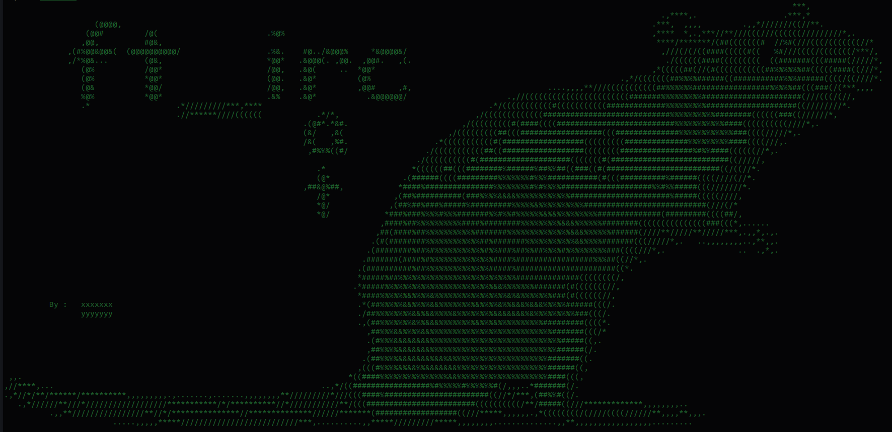
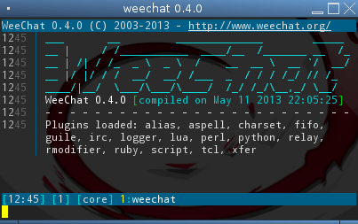

<div id="top"></div>

<div align="center">
 <a href="https://github.com/Link-Wolf/ft_irc" title="Go to GitHub repo"></a>
 <a href="https://"></a>
 <a href="https://"></a>
 <a href="https://github.com/Link-Wolf/ft_irc/stargazers"></a>
 <a href="https://github.com/Link-Wolf/ft_irc/network/members"></a>
 <a href="https://github.com/Link-Wolf/ft_irc/issues"></a>
 <a href="https://www.apple.com/macos/" title="Go to Apple homepage"></a>
</div>

<!-- PROJECT LOGO -->
<br />
<div align="center">
  <a>
    
  </a>

  <h3 align="center">ft_irc</h3>

  <p align="center">
   <em>Internet Relay Chat</em><br/>
    A C++ project to reproduce the behavior of an IRC server  (ft. <a href="https://github.com/sur4c1">iCARUS</a>)
    <br />
    <br />
    <a href="https://github.com/Link-Wolf/ft_irc/issues">Report Bug</a>
    ·
    <a href="https://github.com/Link-Wolf/ft_irc/issues">Request Feature</a>
  </p>
</div>

<!-- TABLE OF CONTENTS -->
<details>
  <summary>Table of Contents</summary>
  <ol>
    <li>
      <a href="#about-the-project">About The Project</a>
    </li>
    <li>
      <a href="#getting-started">Getting Started</a>
      <ul>
        <li><a href="#prerequisites">Prerequisites</a></li>
        <li><a href="#installation">Installation</a></li>
      </ul>
    </li>
    <li><a href="#usage">Usage</a></li>
    <li><a href="#roadmap">Roadmap</a></li>
    <li><a href="#contributing">Contributing</a></li>
    <li><a href="#contact">Contact</a></li>
  </ol>
</details>

<!-- ABOUT THE PROJECT -->

## About The Project

<div align="center">
  <a>
    
  </a>
</div>
</br>
This project aims to reproduce the behavior of a real IRC server in C++ 98. It's a group project i made it with <a href="https://github.com/sur4c1">iCARUS</a>.
It requires us to develop an IRC server that's conform to the IRC standards, so we can connect to it and test it with a real IRC client. We don't have to develop a client, but we chose to use Weechat as our reference client.

Specifically, we have to:

-   Manage many clients without being stucked or blocked
-   Communicate with the clients using TCP/IP protocol
-   It must implement the following features:
    -   Being able to authenticate with a nickname, a username and a realname
    -   Joining a channel
    -   Sending and receiving private messages
    -   Sending and receiving messages to a channel
    -   Having channels operators and basic users
    -   Having all operators specifics commands
    -   exit without any options

As an IRC server, we support the following commands:

-   `NICK` - Change nickname
-   `USER` - Set username and realname
-   `PASS` - Submit password on connect
-   `QUIT` - Quit the server
-   `JOIN` - Join a channel
-   `PART` - Leave a channel
-   `PRIVMSG` - Send a message
-   `TOPIC` - Set or check a channel topic
-   `MODE` - Set or check a user or channel mode
-   `KICK` - Kick a user from a channel
-   `INVITE` - Invite a user to a channel
-   `PING` - Ping the server
-   `NOTICE` - Send a notice

And the `i` channel mode, which allows only invited users to join the channel

We added some bonuses to our server :

-   The `t` channel mode, which allows only operators to change the topic of the channel
-   The ability to send and receive files using the `DCC` command
-   Our fantastic bot, Ratatouille-b0t, who will help you to use our server by answer to your `[...] quoi` messages by `feur` and some others originals surprises !

<p align="right">(<a href="#top">back to top</a>)</p>

<!-- GETTING STARTED -->

## Getting Started

Because it's a simple C++ project, there isn't much to say here

### Prerequisites

Having a C++ compiler like c++

### Installation

1. Clone the repo

    ```sh
    git clone https://github.com/Link-Wolf/ft_irc.git
    ```

2. Compile the project

    ```sh
    cd ft_irc; make
    ```

3. Execute it

    ```sh
    ./ircserv [port] [password]
    ```

<p align="right">(<a href="#top">back to top</a>)</p>

<!-- USAGE EXAMPLES -->

## Usage

Use our IRC server as you'd use a real one, but please be kind to him and remember he doesn't implement everything !

<div align="center">
 <a>
   
 </a>
</div>

<p align="right">(<a href="#top">back to top</a>)</p>

<!-- ROADMAP -->

## Roadmap

-   [x] Add bonus features
-   [x] Add back to top links

See the [open issues](https://github.com/Link-Wolf/ft_irc/issues) for a full list of proposed features (and known issues).

<p align="right">(<a href="#top">back to top</a>)</p>

<!-- CONTRIBUTING -->

## Contributing

If you have a suggestion that would make this better, please fork the repo and create a pull request. You can also simply open an issue with the tag "enhancement".
Don't forget to give the project a star! Thanks again!

1. Fork the Project
2. Create your Feature Branch (`git checkout -b feature/AmazingFeature`)
3. Commit your Changes (`git commit -m 'Add some AmazingFeature'`)
4. Push to the Branch (`git push origin feature/AmazingFeature`)
5. Open a Pull Request

<p align="right">(<a href="#top">back to top</a>)</p>

<!-- CONTACT -->

## Contact

Mail : xxxxxxx@student.42mulhouse.fr

Project Link: [https://github.com/Link-Wolf/ft_irc](https://github.com/Link-Wolf/ft_irc)

<p align="right">(<a href="#top">back to top</a>)</p>
